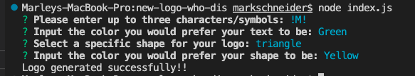
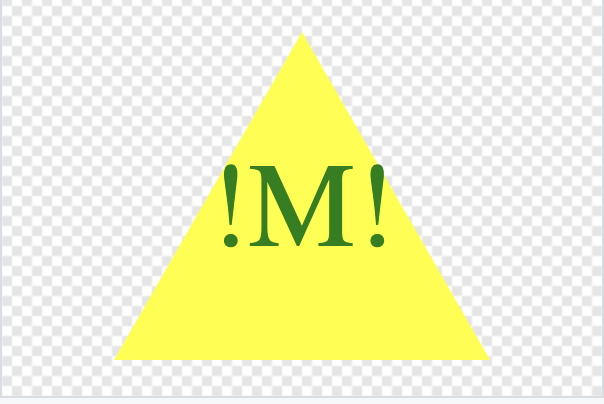

# new-logo-who-dis
A Node.js command-line application that takes in user input to generate a logo and save it as an SVG file.

## Description📓
A Node.js command-line application that takes in user input to generate a logo and save it as an SVG file. The application prompts the user to select a color and shape, provide text for the logo, and save the generated SVG to a .svg file.

## Walkthrough Video  
https://drive.google.com/file/d/1LuAaH9c6CiEljFALs7sB_HGdpQlT4ruJ/view 

## Screenshot of Live Application📂

## Table of Contents
* [Installation](#installation)
* [Dependencies](#dependencies)
* [Usage](#usage)
* [Contributors](#contributors)
* [Testing](#testing)
* [Questions](#questions)

## Installation🖊
To install this project, clone this repository on Github and open it in your personal IDE. First, run `npm i` in the terminal, followed by `node index.js` to get started.

## Dependencies👍
`Node.js`, `Inquirer v8.2.5`, `Jest v29.5.0`

## Usage💡
- To start this application, clone this repository and open it in your personal IDE. 
- Use the terminal/command line and run `npm i` to install all necessary dependencies 
- After, type `node index.js`. This will prompt you through several questions pertaining to the logo you wish to create.
- Once all questions are completed, a message will display to confirm your logo has been created.
- Your new logo will be located in the examples folder.

## Contributors🔋
- Thank you to askBCS for assisting with correcting my inquirer prompts & rendering shapes correctly.

## License🚨

This project is licensed under the [MIT](https://opensource.org/license/mit/) license. 

## Testing🧪
- To run unit testing, open the command line and run `npm run test`.

## Questions❓
If you have questions, please send them [here](mailto:marleysue@gmail.com?subject=[GitHub]%20Dev%20Connect) or visit [github/marleyschneiderr](https://github.com/marleyschneiderr).
